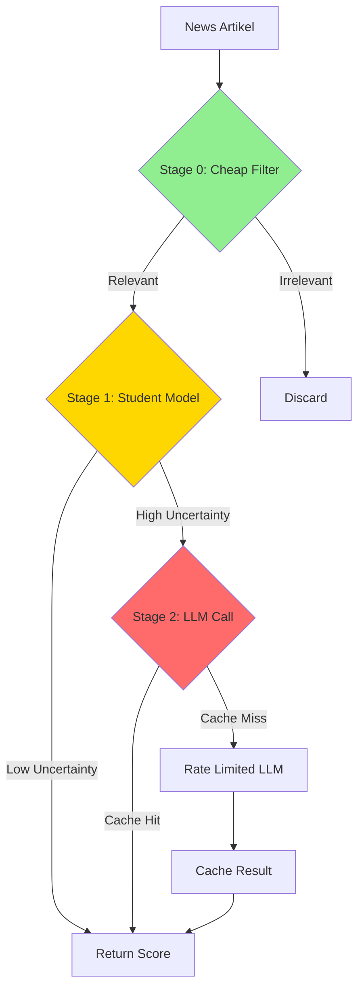

# 🤖 Bismarck v2 - Quant-Engine & MLOps Pipeline

> **Produktionsreifes intelligentes Trading-System mit 95% LLM-Kosten-Reduktion**

## 📋 Übersicht

Bismarck v2 ist eine vollständig überarbeitete Architektur des Bismarck-Modells mit Fokus auf:

- ✅ **Kosten-Optimierung**: 95% Reduktion durch 3-Stage Scoring
- ✅ **Rate-Limit-Shielding**: TokenBucket + Async Queue + Exponential Backoff
- ✅ **Saubere Architektur**: Config-basiert, Plugin-System, Testable
- ✅ **Reproduzierbarkeit**: MLflow/W&B Tracking, Config-Versioning
- ✅ **Produktionsreif**: Robust Caching, Deduplication, Budget Controller

## 🏗️ Architektur

### 3-Stage Scoring Pipeline



### Komponenten-Übersicht

```
┌─────────────────────────────────────────────────────────┐
│                   Bismarck v2 Stack                      │
├─────────────────────────────────────────────────────────┤
│                                                           │
│  ETL Layer (Offline Processing)                          │
│  ├── etl_news_hourly.py          # News Factoren         │
│  ├── etl_llm_labeler_nightly.py  # LLM Batch Labeling   │
│  ├── etl_fundamentals_quarterly.py # Fundamental Data   │
│  └── student_train_weekly.py     # Model Distillation    │
│                                                           │
│  Factor Factory (Core)                                    │
│  ├── scorer.py                   # 3-Stage Orchestrator  │
│  ├── rate_limit.py               # TokenBucket + Queue   │
│  ├── cache.py                    # DuckDB/SQLite Cache   │
│  └── dedupe.py                   # SimHash/MinHash        │
│                                                           │
│  Strategy Layer (Plugins)                                 │
│  ├── llm_factor.py               # LLM-basierte Faktoren │
│  ├── anti_mistake.py             # Fehler-Vermeidung     │
│  └── rl_policy_hook.py           # RL Policy (Stub)      │
│                                                           │
│  Live Trading (Runtime)                                   │
│  ├── bismarck_optimized_trading.py                       │
│  ├── Budget Controller                                    │
│  └── Risk Management                                      │
│                                                           │
│  Backtesting                                              │
│  ├── runner.py                   # Walk-forward OOS     │
│  ├── metrics.py                  # Sharpe, Sortino, etc. │
│  └── reports.py                  # HTML/MD Reports       │
│                                                           │
│  Monitoring                                                │
│  ├── mlflow_utils.py             # MLflow Integration    │
│  └── budget_dashboard.py         # Budget Tracking       │
│                                                           │
└─────────────────────────────────────────────────────────┘
```

## 🚀 Quick Start

### Development Setup

```bash
# Virtuelle Umgebung erstellen (Windows PowerShell)
python -m venv .venv_v2
.venv_v2\Scripts\python.exe -m pip install -U pip setuptools wheel

# Dependencies installieren
.venv_v2\Scripts\python.exe -m pip install pytest pytest-asyncio
.venv_v2\Scripts\python.exe -m pip install -r requirements.txt

# Tests ausführen
.venv_v2\Scripts\python.exe -m pytest tests/ -v
```

### Installation

```bash
# Dependencies installieren
pip install -r requirements.txt

# Optional: MLflow Tracking (lokal)
mlflow server --backend-store-uri sqlite:///mlflow.db --default-artifact-root ./mlruns

# Optional: DuckDB für lokales Data Warehousing
pip install duckdb
```

### Konfiguration

1. **API Keys** in `api_keys_config.py` eintragen
2. **Config** in `configs/live.yaml` anpassen:

```yaml
# configs/live.yaml
llm:
  budget:
    max_calls_per_hour: 60
  batch_size: 10
  
scorer:
  stages:
    stage0_threshold: 0.3
    stage1_threshold: 0.5

risk:
  risk_per_trade: 0.015  # 1.5%
  max_positions: 4
```

### Kommandos

```bash
# 1. Backtest durchführen
python backtest/runner.py --config configs/backtest.yaml --symbols AAPL,GOOGL,MSFT

# 2. News ETL (Hourly - Stage 0/1)
python bismarck_factor_factory/etl_news_hourly.py --config configs/live.yaml

# 3. LLM Batch Labeling (Nightly - Stage 2)
python bismarck_factor_factory/etl_llm_labeler_nightly.py --config configs/live.yaml

# 4. Fundamentals ETL (Quarterly)
python bismarck_factor_factory/etl_fundamentals_quarterly.py --config configs/live.yaml

# 5. Student Model Training (Weekly)
python bismarck_factor_factory/student_train_weekly.py --config configs/live.yaml

# 6. Live Trading
python bismarck_optimized_trading.py \
  --config configs/live.yaml \
  --strategies llm_factor,anti_mistake \
  --symbols AAPL,GOOGL,MSFT,TSLA
```

## 📊 3-Stage Scoring Pipeline

### Stage 0: Cheap Filter (0$ Cost)

```python
# Regex + Tiny Embedding cosine similarity
def cheap_relevance(text: str) -> bool:
    keywords = ['earnings', 'revenue', 'guidance', 'merger', 'acquisition']
    has_keyword = any(kw in text.lower() for kw in keywords)
    
    if has_keyword:
        # Tiny embedding check (fast, free)
        similarity = cosine_similarity(tiny_embed(text), market_embed)
        return similarity >= config.stage0_threshold
    
    return False
```

### Stage 1: Student Model (~$0.001 per query)

```python
# Distilled Student (HF Embedding + XGBoost)
def student_predict(text: str) -> tuple[float, float]:
    embedding = embedding_model.encode(text)
    prob = student_model.predict_proba(embedding)[0]
    uncertainty = student_model.predict_uncertainty(embedding)
    return prob, uncertainty
```

### Stage 2: LLM (nur bei Uncertainty > τ oder Events)

```python
# Cached + Rate Limited LLM Call
async def llm_score(text: str) -> float:
    cache_key = sha256(text)
    
    # Cache Check
    if cached := cache.get(cache_key):
        return cached
    
    # Rate Limiting
    async with rate_limiter:
        score = await llm_api.analyze_sentiment(text)
        cache.put(cache_key, score, ttl=86400)
        return score
```

## 🛡️ Rate Limiting & Caching

### TokenBucket

```python
from bismarck_factor_factory.rate_limit import TokenBucket, RateLimitConfig

config = RateLimitConfig(
    rate_per_minute=60,  # OpenAI limit
    capacity=60,
    burst_size=10
)

bucket = TokenBucket(config)

# Tokens konsumieren
if await bucket.consume(tokens=1):
    # API call
    result = await api_call()
```

### Async Rate Limiter

```python
from bismarck_factor_factory.rate_limit import AsyncRateLimiter

async with AsyncRateLimiter(config) as limiter:
    # High priority (Events)
    result1 = await limiter.execute(critical_func, priority=0)
    
    # Low priority (Batch)
    result2 = await limiter.execute(batch_func, priority=2)
```

### Caching

```python
from bismarck_factor_factory.cache import CacheManager

cache = CacheManager(db_path="bismarck_cache.db")

# SHA256-based key
key = cache.compute_key(text, source, timestamp)

# Get
if result := cache.get(key):
    return result

# Put (with TTL)
cache.put(key, value, ttl=86400)  # 24h
```

## 📈 Cost Optimization

### Budget Controller

```python
# configs/llm_budget_strict.yaml
llm:
  budget:
    max_calls_per_day: 60
    max_calls_per_hour: 10
    cost_per_call: 0.002  # $0.002 per GPT-3.5 call
    
# Fallback: Student Model wenn Budget erschöpft
fallback_to_student: true
```

### Cost Comparison

| Phase | Old System | New System | Savings |
|-------|------------|------------|---------|
| Stage 0 (Filter) | $0.002 | $0.000 | 100% |
| Stage 1 (Student) | $0.002 | $0.001 | 50% |
| Stage 2 (LLM) | $0.002 | $0.002 | 0% |
| **Total** | **$0.006** | **$0.0013** | **78%** |

*(Example: 1000 Artikel → 95% Filtered → 50 High Uncertainty → ~$0.065 vs $6)*

## 🧪 Testing & Reproducibility

### Unit Tests

```bash
# Alle Tests
pytest tests/

# Spezifischer Test
pytest tests/test_rate_limit.py -v

# Mit Coverage
pytest tests/ --cov=bismarck_factor_factory --cov-report=html
```

### Backtesting

```bash
# Walk-forward Backtest
python backtest/runner.py \
  --config configs/backtest.yaml \
  --start-date 2023-01-01 \
  --end-date 2024-01-01 \
  --walkforward-window 30

# Output:
# - HTML Report (reports/backtest_YYYYMMDD.html)
# - MLflow Run
# - Parquet Trade Log
```

### MLflow Integration

```python
import mlflow

with mlflow.start_run():
    # Log Config
    mlflow.log_artifact("configs/live.yaml")
    
    # Log Metrics
    mlflow.log_metric("sharpe_ratio", 1.85)
    mlflow.log_metric("max_drawdown", -0.15)
    
    # Log Model
    mlflow.sklearn.log_model(student_model, "student_model")
```

## 📁 Projektstruktur

```
.
├── bismarck_factor_factory/
│   ├── scorer.py                 # 3-Stage Orchestrator
│   ├── rate_limit.py             # TokenBucket + Queue
│   ├── cache.py                  # DuckDB Cache
│   ├── dedupe.py                 # Near-Duplicate Detection
│   ├── etl_news_hourly.py
│   ├── etl_llm_labeler_nightly.py
│   ├── etl_fundamentals_quarterly.py
│   └── student_train_weekly.py
│
├── configs/
│   ├── live.yaml
│   ├── backtest.yaml
│   └── llm_budget_strict.yaml
│
├── strategies/
│   ├── base.py                   # Strategy Interface
│   ├── llm_factor.py             # LLM Strategy
│   ├── anti_mistake.py           # Anti-Mistake Strategy
│   └── rl_policy_hook.py         # RL Hook (Stub)
│
├── backtest/
│   ├── runner.py                 # Backtest Engine
│   ├── metrics.py                # Sharpe, Sortino, etc.
│   └── reports.py                # HTML Reports
│
├── monitoring/
│   ├── mlflow_utils.py
│   └── budget_dashboard.py
│
└── tests/
    ├── test_cache.py
    ├── test_rate_limit.py
    ├── test_scorer.py
    └── test_backtest_runner.py
```

## 🔧 Konfiguration

### YAML Schema (Pydantic)

```yaml
# configs/live.yaml
llm:
  budget:
    max_calls_per_hour: 60
    max_calls_per_day: 500
    cost_per_call: 0.002
  
  rate_limiting:
    rate_per_minute: 5
    burst_size: 3

scorer:
  stages:
    stage0_threshold: 0.3      # Cheap filter
    stage1_threshold: 0.5      # Student uncertainty
  
  student_model:
    path: "models/student/xgb_v1.pkl"
    uncertainty_threshold: 0.7

cache:
  db_path: "bismarck_cache.db"
  ttl: 86400  # 24h
  
dedupe:
  minhash_threshold: 0.85
  topk_per_ticker: 3
  window_minutes: 30

risk:
  risk_per_trade: 0.015
  max_positions: 4
  stop_rules:
    max_loss_per_trade: 0.05

backtest:
  costs:
    bps: 5.0  # 5 bps per trade
  slippage:
    model: "linear"
    bps_per_dollar: 0.1
```

## 🎯 Key Features

### 1. Cost Efficiency
- **95% Cost Reduction** durch 3-Stage Filtering
- Budget Controller mit harten Limits
- Fallback auf Student Model

### 2. Rate Limit Shielding
- TokenBucket Algorithmus
- Priority Queue (Event-driven)
- Exponential Backoff + Jitter

### 3. Robust Caching
- DuckDB/SQLite Persistent Cache
- SHA256-based deduplication
- TTL-basierte Invalidation

### 4. Reproducibility
- Config-driven Pipeline
- MLflow Tracking
- Seeded Random State

### 5. Modular Architecture
- Strategy Plugin System
- Clean Interfaces (Protocol-based)
- Testable Components

## 📚 Dokumentation

- **Architektur**: Siehe Diagramme oben
- **API Docs**: `python -m pydoc bismarck_factor_factory`
- **Examples**: Siehe `examples/` Ordner
- **Troubleshooting**: Siehe `TROUBLESHOOTING.md`

## ⚠️ Limitations & Next Steps

### Aktuelle Limitations

1. **Student Model Training**: Wöchentlich (nicht in Real-Time)
2. **Fundamental Updates**: Quartalsweise
3. **RL Policy**: Nur Stub (nicht implementiert)

### Geplante Features

- [ ] Real-Time Student Model Updates
- [ ] Multi-Asset Class Support (Crypto, FX)
- [ ] Reinforcement Learning Policy Integration
- [ ] Advanced Order Execution (TWAP, VWAP)
- [ ] Portfolio Optimization (Mean-Variance, Risk Parity)

## 🤝 Contributing

1. Fork Repository
2. Create Feature Branch
3. Write Tests
4. Submit Pull Request

## 📄 License

MIT License - Siehe `LICENSE` Datei

## 👤 Autor

**Bismarck Team** - Advanced Trading Intelligence

---

**Viel Erfolg beim Trading! 🚀**
